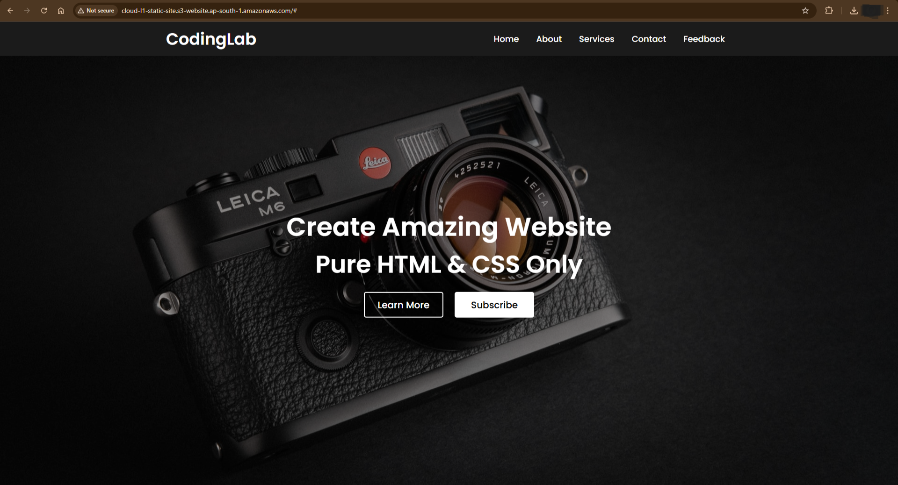

# 🌐 CloudL1 -- S3 Static Website Hosting

A static website hosted using Amazon S3.\
This project focuses on understanding object storage, public access
configuration, and how static hosting works in a fully serverless
architecture.

The goal was not just to host a website --- but to understand what
happens behind the scenes.

------------------------------------------------------------------------

## 📦 Technologies

-   Amazon S3
-   AWS Console
-   Bucket Policies
-   IAM Concepts
-   HTML
-   CSS
-   JavaScript

------------------------------------------------------------------------

## 🦄 Features

Here's what this project demonstrates:

-   **Static Website Hosting**: Hosting HTML, CSS, and JS files directly
    from an S3 bucket.
-   **Public Access Configuration**: Managing Block Public Access
    settings properly.
-   **Bucket Policy Implementation**: Writing JSON policy to allow
    public read access.
-   **Serverless Architecture**: No EC2. No backend. Only object
    storage.
-   **Error Handling & Troubleshooting**: Solving real-world AWS errors
    like AccessDenied and NoSuchKey.

------------------------------------------------------------------------

## 🏗️ Architecture

User (Browser)\
↓\
S3 Static Website Endpoint\
↓\
S3 Bucket (HTML, CSS, JS)

This is a fully serverless architecture.

There is: - No compute layer - No database - No backend server

Only object storage serving static content.

------------------------------------------------------------------------

## 🚀 What You Can Do

After completing this setup, you can:

-   Host any static website (portfolio, landing page, documentation
    site)
-   Understand how AWS handles object-level permissions
-   Configure bucket policies manually
-   Troubleshoot common beginner mistakes
-   Deploy static content in minutes

------------------------------------------------------------------------

## 👩🏽‍🍳 The Process

I started by creating a uniquely named S3 bucket in the Mumbai region
(ap-south-1).

S3 blocks public access by default, so hosting requires intentional
configuration.

Next, I uploaded the website files --- making sure they were placed in
the root level of the bucket. If files are uploaded inside a folder, S3
cannot find index.html, which results in a NoSuchKey error.

After that, I enabled Static Website Hosting from the Properties tab and
defined: - index.html as the index document - error.html as the error
document

AWS then generated a public website endpoint.

Accessing it initially resulted in Access Denied.

That's when I understood the difference between: - Block Public Access
settings - Bucket Policies - Object-level permissions

I wrote a bucket policy allowing s3:GetObject for all objects inside the
bucket.

Once applied correctly, the website became publicly accessible.

------------------------------------------------------------------------

## 🛠️ Troubleshooting Faced

### ❌ Access Denied

Cause: - Block Public Access still enabled\
- Missing bucket policy

Fix: - Disable all 4 Block Public Access settings\
- Add correct public-read bucket policy

------------------------------------------------------------------------

### ❌ NoSuchKey Error

Cause: - index.html inside a folder\
- Wrong file name (case-sensitive)\
- Incorrect index document name

Fix: - Move files to bucket root\
- Ensure exact filename: index.html\
- Remember: S3 is case-sensitive

------------------------------------------------------------------------

### ❌ CSS Not Loading

Cause: - Incorrect relative file path

Fix: `<link rel="stylesheet" href="style.css">`{=html}

------------------------------------------------------------------------

## 💰 Cost Awareness

Under AWS Free Tier:

-   5GB storage free
-   20,000 GET requests free
-   2,000 PUT requests free

For a small static site, the cost is usually negligible.

Cloud cost awareness is critical. Always delete unused resources.

------------------------------------------------------------------------

## 🔐 Security Note

This setup allows public access for learning purposes.

In production environments, best practice would include:

-   Using CloudFront for CDN
-   Enabling HTTPS
-   Restricting direct bucket public access
-   Using Origin Access Control (OAC)

------------------------------------------------------------------------

## 📚 What I Learned

### 🪣 S3 Deep Understanding

-   Difference between bucket-level and object-level permissions
-   How public access settings override policies
-   Why S3 blocks public access by default

### 📜 Bucket Policies

-   Understanding Principal, Action, and Resource
-   How wildcard (\*) works in ARN paths

### 🧠 Cloud Troubleshooting

-   Diagnosing errors logically
-   Understanding AWS error messages
-   Fixing configuration issues systematically

### 💸 Cost Discipline

-   Importance of deleting unused resources
-   Monitoring storage usage
-   Thinking about billing early

------------------------------------------------------------------------

## 🧹 Resource Cleanup (IMPORTANT)

### Step 1 --- Empty the Bucket

1.  Open bucket\
2.  Click Empty\
3.  Confirm permanent deletion

### Step 2 --- Delete the Bucket

1.  Select bucket\
2.  Click Delete\
3.  Confirm bucket name\
4.  Delete

Always verify that: - The bucket no longer appears - Storage usage
returns to zero

------------------------------------------------------------------------

## 🎯 How It Can Be Improved

-   Add CloudFront integration
-   Add custom domain with Route 53
-   Enable HTTPS using ACM
-   Implement CI/CD deployment
-   Add versioning to the bucket
-   Enable logging and monitoring

------------------------------------------------------------------------

## 🏁 Final Result

The static website is successfully deployed and accessible via the S3
Website Endpoint.

This project builds strong foundational cloud knowledge and prepares for
more advanced AWS architectures.

------------------------------------------------------------------------

## 📸 Screenshots

