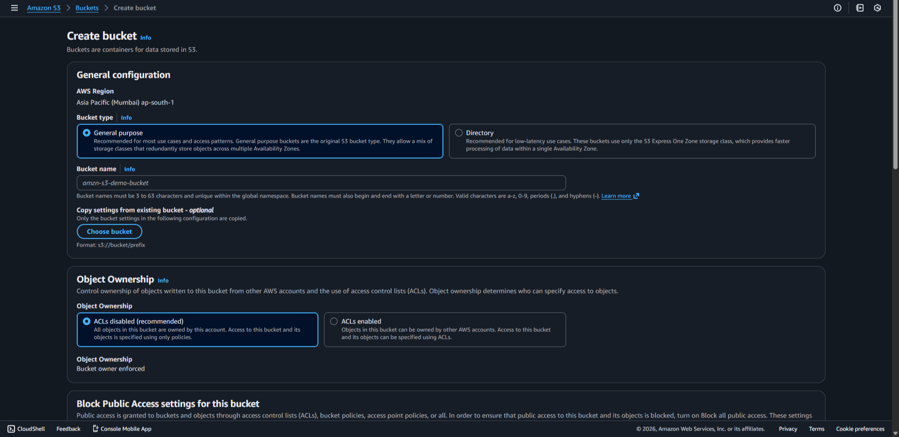
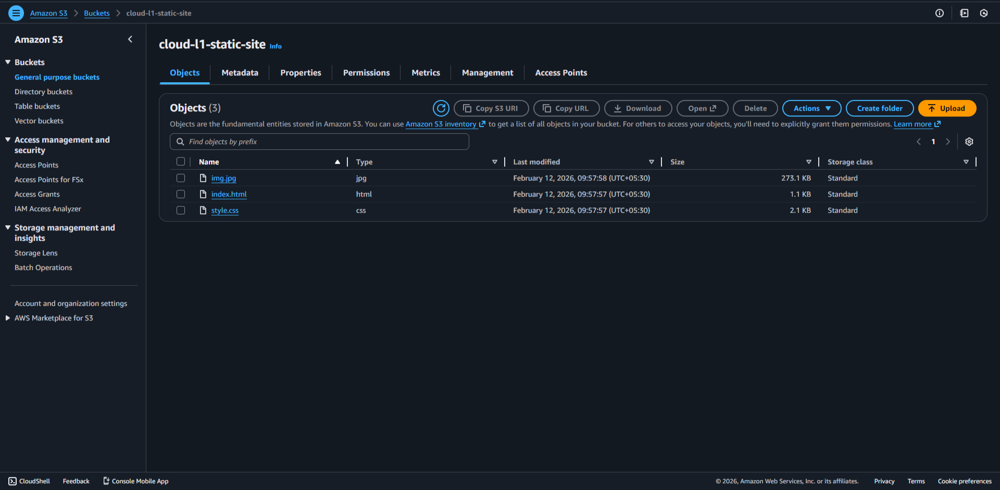
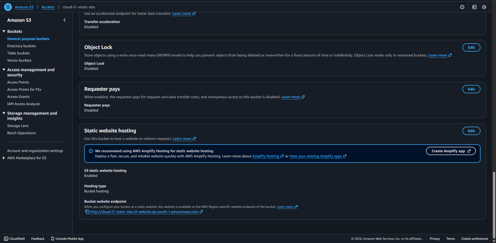
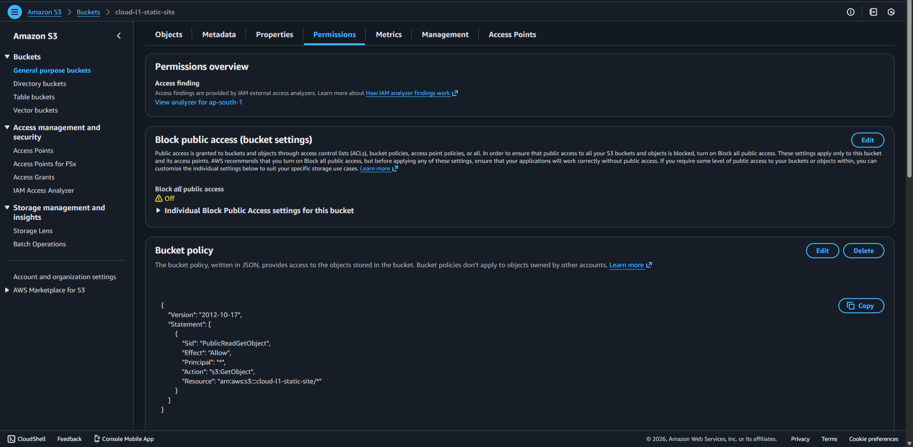
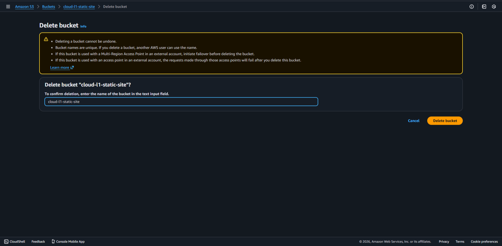

# 🌐S3 Static Website Hosting (Cloud L1)

## 📌 Project Overview

This project demonstrates how to host a static website using **Amazon
S3**.

The objective was to: - Create an S3 bucket - Upload website files
(HTML, CSS, JS) - Enable Static Website Hosting - Configure public
access using Bucket Policy - Troubleshoot common hosting errors

This project builds foundational knowledge of: - AWS S3 - Object
Storage - Bucket Policies - Public Access Configuration - Static Hosting
Architecture

------------------------------------------------------------------------

## 🏗️ Architecture

User (Browser)\
↓\
S3 Static Website Endpoint\
↓\
S3 Bucket (HTML, CSS, JS files)

This is a fully serverless architecture. No EC2. No backend. Only object
storage.

------------------------------------------------------------------------

## ⚙️ Configuration Details

### 🪣 Bucket Configuration

-   **Bucket Name:** cloud-l1-static-site-`<unique-name>`{=html}
-   **Region:** Asia Pacific (Mumbai) -- ap-south-1
-   **Block Public Access:** Disabled (All 4 unchecked)
-   **Static Website Hosting:** Enabled

------------------------------------------------------------------------

## 🚀 Implementation Steps

### Step 1 --- Create S3 Bucket

1.  Go to AWS Console → S3\
2.  Click Create bucket\
3.  Enter unique bucket name\
4.  Select region: ap-south-1\
5.  Uncheck Block all public access\
6.  Acknowledge warning\
7.  Click Create bucket

------------------------------------------------------------------------

### Step 2 --- Upload Website Files

Files must be uploaded at the **root level**.

Correct structure:

index.html\
style.css\
script.js\
images/

Incorrect structure:

project-folder/\
index.html

If inside a folder → S3 throws `NoSuchKey` error.

------------------------------------------------------------------------

### Step 3 --- Enable Static Website Hosting

1.  Open bucket\
2.  Go to Properties\
3.  Scroll to Static Website Hosting\
4.  Click Edit\
5.  Enable hosting\
6.  Index document: index.html\
7.  Error document: error.html\
8.  Save changes

AWS generates a website endpoint URL like:

http://bucket-name.s3-website-ap-south-1.amazonaws.com

------------------------------------------------------------------------

### Step 4 --- Configure Bucket Policy

Go to:

Permissions → Bucket Policy → Edit

Add:

{ "Version": "2012-10-17", "Statement": \[ { "Sid":
"PublicReadGetObject", "Effect": "Allow", "Principal": "*", "Action":
"s3:GetObject", "Resource":
"arn:aws:s3:::cloud-l1-static-site-`<your-name>`{=html}/*" } \] }

Replace with your actual bucket name.

This allows public read access to all objects in the bucket.

------------------------------------------------------------------------

## 🛠️ Troubleshooting Faced

### ❌ Error: Access Denied

Cause: - Bucket policy missing - Block Public Access enabled

Fix: - Add correct bucket policy - Disable all 4 Block Public Access
settings

------------------------------------------------------------------------

### ❌ Error: NoSuchKey

Cause: - index.html inside folder - Wrong filename case - Incorrect
index document name

Fix: - Move files to bucket root - Ensure exact name: index.html - S3 is
case-sensitive

------------------------------------------------------------------------

### ❌ CSS Not Loading

Cause: - Incorrect file path in HTML

Fix: Check correct path usage:

`<link rel="stylesheet" href="style.css">`{=html}

------------------------------------------------------------------------

## 💰 Cost Analysis

Under AWS Free Tier:

-   5GB storage free
-   20,000 GET requests free
-   2,000 PUT requests free

Estimated cost for small static site: ₹0 -- ₹5 per month

------------------------------------------------------------------------

------------------------------------------------------------------------

## 🔐 Security Note

This setup allows public access for learning purposes.

In production: - Use CloudFront - Enable HTTPS - Restrict public bucket
access - Use Origin Access Control (OAC)

------------------------------------------------------------------------

## 🏁 Final Result

The static website is successfully hosted and accessible via the S3
Website Endpoint.

------------------------------------------------------------------------

# 🧹 Resource Cleanup (IMPORTANT)

To avoid unnecessary AWS charges, always delete resources after
completing the project.

## 🗑️ Step 1 --- Empty the Bucket

AWS does NOT allow deleting a bucket unless it is empty.

1.  Go to S3 → Open your bucket
2.  Click "Empty"
3.  Type "permanently delete"
4.  Confirm deletion

------------------------------------------------------------------------

## 🗑️ Step 2 --- Delete the Bucket

1.  Go back to S3 bucket list
2.  Select your bucket
3.  Click "Delete"
4.  Type the bucket name to confirm
5.  Click Delete bucket

------------------------------------------------------------------------

## Verification

After deletion: - Bucket should no longer appear in S3 list - Storage
usage should return to zero (if no other buckets exist)

------------------------------------------------------------------------

## 🎓 Learning Outcomes

After completing this project, I understand:

-   How S3 stores objects
-   Difference between bucket and object permissions
-   How public access works in AWS
-   How bucket policies control object-level access
-   Common beginner mistakes in static hosting
-   Troubleshooting real-world cloud errors
-   Cloud cost awareness and resource cleanup best practices

